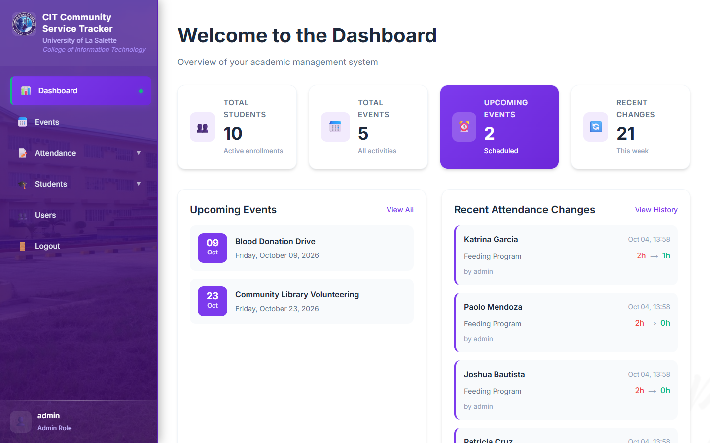
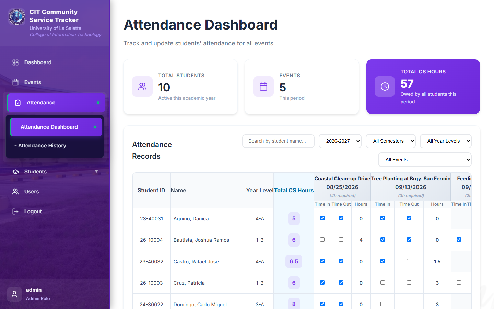
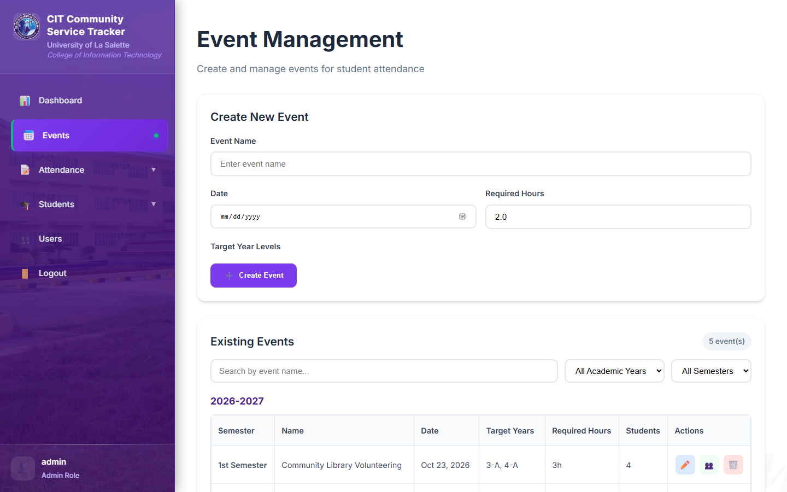
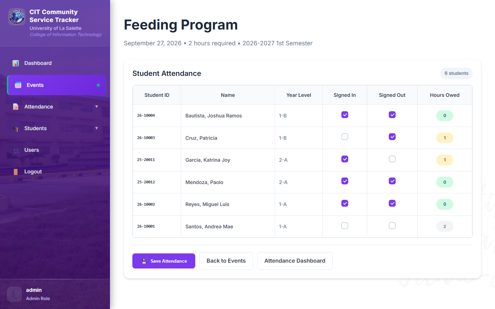
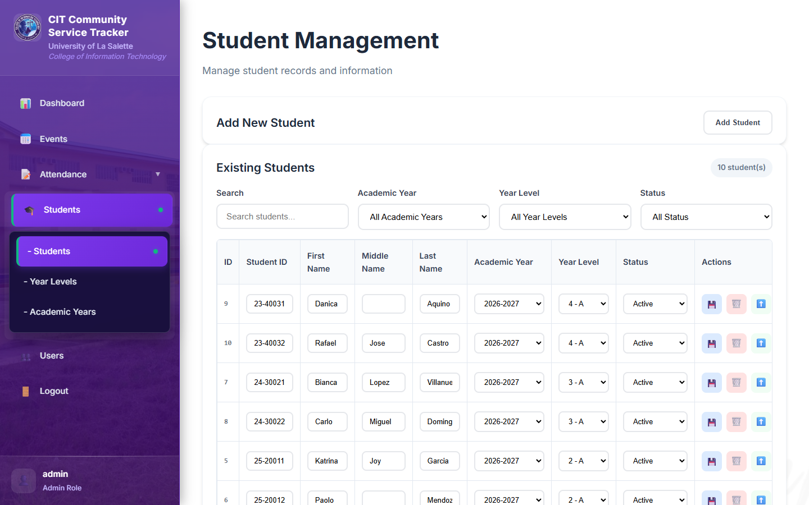
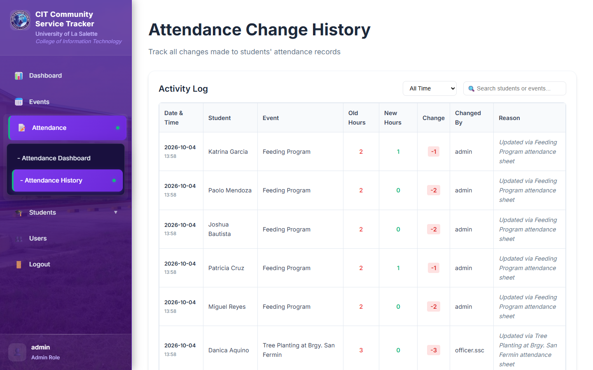

<p align="center">
  
</p>

<h1 align="center">CIT Community Service Tracker</h1>

<p align="center">
  
  
  
  
  
  
</p>

<p align="center">
  <a href="#quick-start"><strong>Quick Start</strong></a> ·
  <a href="#roles">Roles</a> ·
  <a href="AUTHORS.md">Authors</a> ·
  <a href="https://github.com/nncast/flask-community-service-tracker/releases" target="_blank" rel="noopener noreferrer">Release Notes</a>
</p>

The CIT Community Service Tracker is a Flask web app for the University of La Salette College of Information Technology. Officers record which students signed in and out of community service events, and the app tracks the service hours each student still owes per semester.

> **Current version: v0.2.0** — Redesigned interface (calmer sidebar, aligned attendance table with pinned headers, consistent pages, phone layout) and uv for setup. See the [Release Notes](https://github.com/nncast/flask-community-service-tracker/releases) for the full version history.

<p align="center">
  
  
</p>
<p align="center">
  
  
</p>
<p align="center">
  
  
</p>

<p align="center"><sub>Dashboard · Attendance Dashboard · Events · Event Attendance · Students · Attendance History</sub></p>

## How hours work

Each event has a number of **required hours**. Every student in the event's target year levels owes those hours until they attend:

| Signed in | Signed out | Hours owed |
|:---:|:---:|:---:|
| Yes | Yes | 0 |
| Yes | No | half |
| No | Yes | half |
| No | No | full |

A student's **Total CS Hours** is the sum for the selected academic year or semester, and every change is logged in Attendance History.

## Roles

- **Admin**: everything, including Students, Year Levels, Academic Years and Users.
- **Officer**: Dashboard, Events and Attendance.

## Contributing

Contributions are welcome. Fork the repository, work on a branch from `main`, and open a pull request describing what changed and why. See [CONTRIBUTING.md](CONTRIBUTING.md) for the workflow and code style, and [AUTHORS.md](AUTHORS.md) for the people who built it.

## Security

Please don't report vulnerabilities in public issues. Use the repository's **Security → Report a vulnerability** tab instead. See [SECURITY.md](SECURITY.md) for details.

## Quick Start

Requires [uv](https://docs.astral.sh/uv/getting-started/installation/) and optionally [Git](https://git-scm.com/downloads). uv installs the right Python (3.12+) and every dependency for you.

```
git clone https://github.com/nncast/flask-community-service-tracker.git
cd flask-community-service-tracker

uv run app.py
```

The first `uv run` creates a `.venv` and installs the locked dependencies from `uv.lock`; later runs start immediately.

<details>
<summary>Without uv (plain pip)</summary>

```
python -m venv .venv
.venv\Scripts\activate         # Windows
source .venv/bin/activate      # macOS/Linux

pip install flask==2.3.3 werkzeug==2.3.8 flask-sqlalchemy==3.0.5 flask-migrate==4.0.4 "sqlalchemy>=2.0.41,<2.2"
python app.py
```

Or generate a requirements file from the lockfile with `uv export --no-hashes -o requirements.txt`.
</details>

Open **http://localhost:5000** and sign in with `admin` / `admin123`. **Change this password after the first login.**

On first run the app creates its SQLite database (`dbcs.db`) and a random session secret key (`secret_key`) in the `instance/` folder. To use your own secret key, set the `SECRET_KEY` environment variable before starting the app.

**First-time setup:** add an **Academic Year** with its semester dates, then **Year Levels**, then **Students**. After that you can create **Events** and record attendance.

---

<p align="center"><i>CIT Community Service Tracker · Flask · SQLAlchemy · SQLite · Vanilla JS</i></p>
